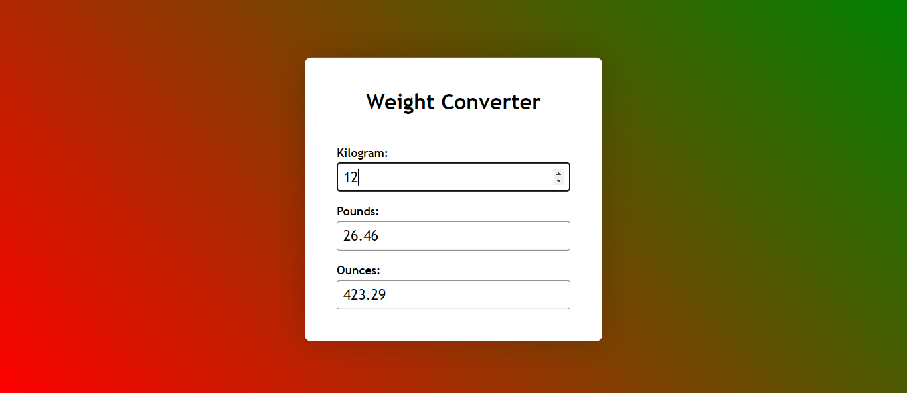

# Weight Converter

## Features

* It converts weight into three types Kilograms, Pounds and Ounces.

* When we enter any one value converts remaining values and gives output of three type of weights.

### HTML 

Created a container with three inputs which are user interactive.

### CSS 

Added style properties for the inputs, background and headings.

### JavaScript 

### Created Id's for inputs of Kilogram, Pounds and Ounces

Given Id's for the inputs which are user interactive stored in variables.

### Added EventListeners for the inputs

Added eventlisters for Kilogram, Pounds and Ounces when the user enters the value it calls the required function whether it is kilogram or pounds or Ounces.

### Created functions for weight convertion

* If user enter kilograms it calls convert from kg function to convert the pounds and Ounces to calculate weights based on kilograms. 

*  If user enter pounds it calls convert from pounds function to convert the kilograms and Ounces to calculate weights based on pounds. 

* If user enter Ounces it calls convert from Ounces function to convert the pounds and kilograms to calculate weights based on Ounces. 

